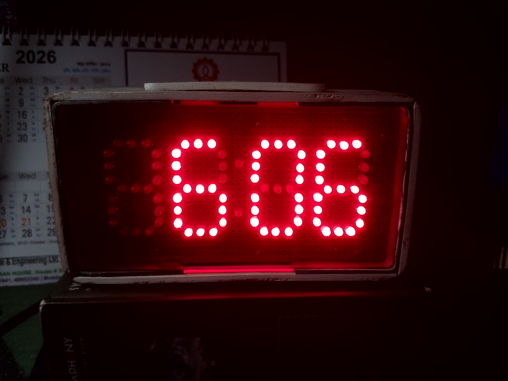
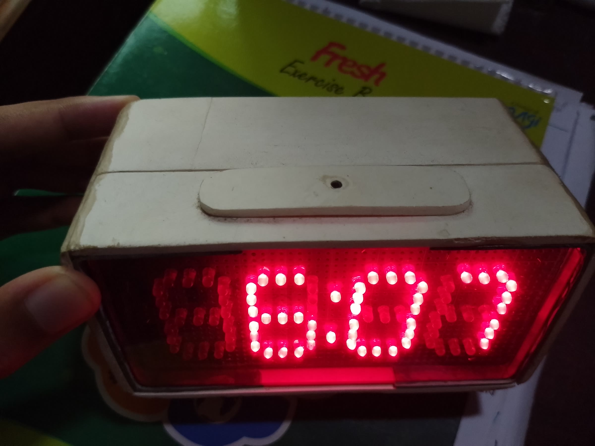
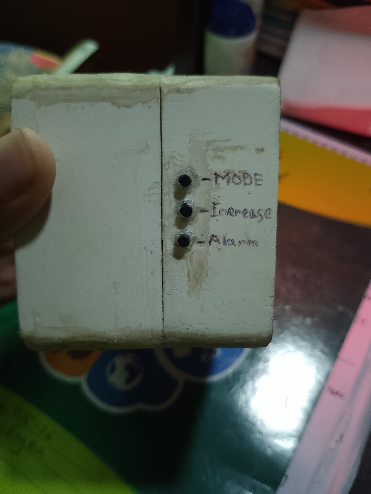
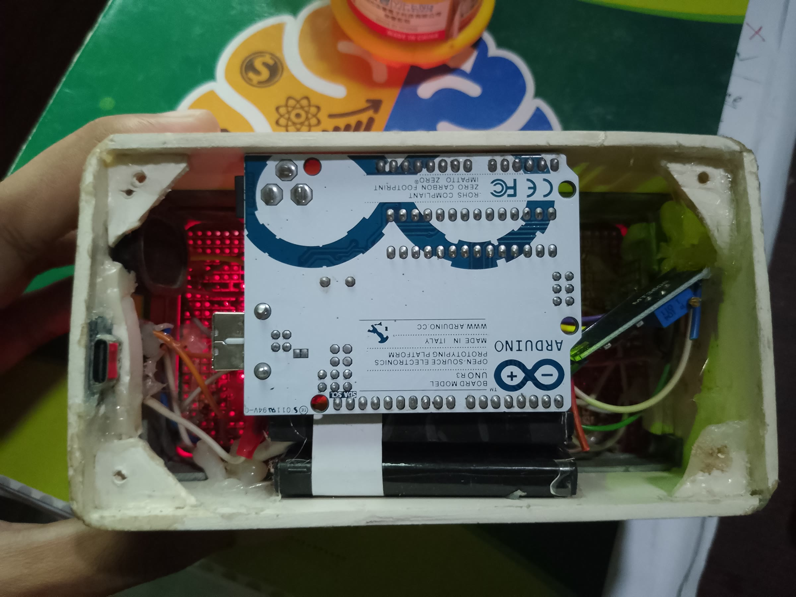
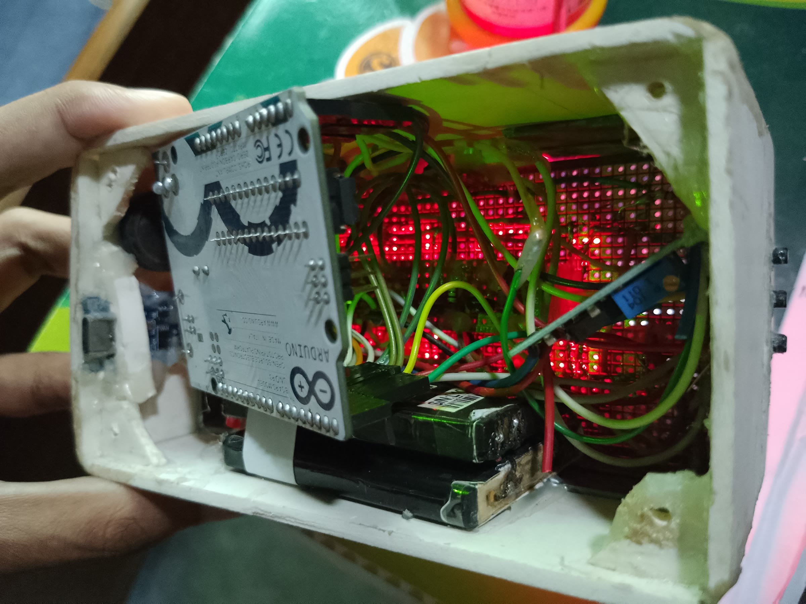
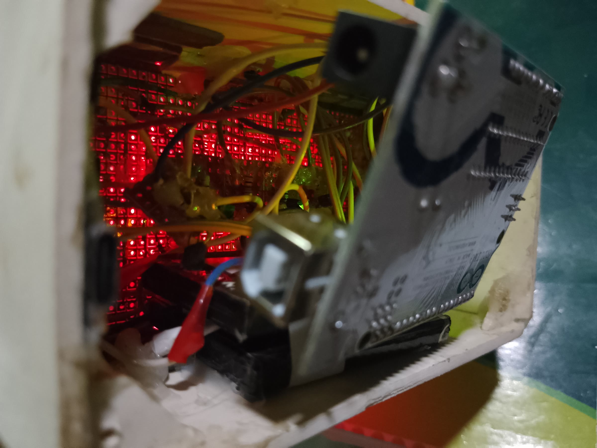

# 🚀 No RTC Alarm Clock

A fully functional **Arduino-based digital clock system** built using embedded programming techniques.  
This project implements real-time clock behavior using `millis()` instead of an RTC module, along with advanced features like **alarm, snooze, and multi-mode user interaction**.

---

## 📸 Demo

Watch the clock in action — running mode, setting the time, and the escalating 3-tone alarm:

https://github.com/user-attachments/assets/867163c2-525e-4efa-aa58-76ae71a50ead

📥 [Download the demo video (MP4, ~9 MB)](media/demo.mp4) — also committed in this repo as `media/demo.mp4`.

### 🖼️ Gallery

<table>
  <tr>
    <td align="center" width="50%">
       
      <b>Reading the time in the dark</b> — the multiplexed 7-segment display stays perfectly readable with no backlight.
    </td>
    <td align="center" width="50%">
       
      <b>The hand-made case</b> — a front / side view of the hand-built enclosure around the 4-digit display.
    </td>
  </tr>
  <tr>
    <td align="center" width="50%">
       
      <b>Control panel</b> — the labelled push buttons: <b>MODE</b>, <b>Increase</b> and <b>Alarm</b>.
    </td>
    <td align="center" width="50%">
       
      <b>Inside the case</b> — an Arduino Uno driving the 7-segment display module behind it.
    </td>
  </tr>
  <tr>
    <td align="center" width="50%">
       
      <b>Power and wiring</b> — battery pack, segment driver wiring and the digit control transistor lines.
    </td>
    <td align="center" width="50%">
       
      <b>Alarm hardware</b> — close-up of the piezo buzzer and the battery that powers the clock.
    </td>
  </tr>
</table>

---

## ✨ Features

### ⏱️ Timekeeping
- 12-hour format with **AM/PM support**
- Accurate timing using `millis()` (non-blocking)
- Manual **drift compensation system**
- No external RTC module required

---

### ⏰ Alarm System
- Set custom alarm time (hours & minutes)
- AM/PM-aware alarm triggering
- Escalating **3-tone buzzer pattern** (1 kHz → 1.5 kHz → 2 kHz, non-blocking)
- Auto-stop after 60 seconds

---

### 😴 Snooze Functionality
- Short press → Snooze (5 minutes)
- Long press → Stop alarm completely
- Snooze auto-reactivates alarm after delay
- Snooze cancel option

---

### 🎛️ User Interaction
- Multiple buttons with:
  - Debouncing
  - Short press detection
  - Long press detection
- Modes:
  - Clock run mode
  - Time setting mode
  - Alarm setting mode

---

### 🔢 Display System
- 4-digit **7-segment multiplexed display**
- Efficient refresh (~2ms per cycle)
- Leading zero suppression
- Blinking digits during setting modes

---

### 🔔 Visual Feedback
- Colon LED behavior:
  - Normal → 1 Hz blink ( 1 second blink per 2 seconds)
  - Alarm → fast blink
  - Snooze → slow blink
  - Setting mode → AM/PM indicator
- Alarm enable/disable blink indication

---

### ⚡ Embedded Design Highlights
- Fully **non-blocking code (no delay())**
- Event-driven button handling
- Clean modular functions
- Efficient memory usage
- Real-time system behavior

---

## 🛠️ Hardware Requirements

- Arduino Uno / Nano
- 4-digit 7-segment display (common cathode)
- Transistors (for digit control)
- Resistors (for segments & base)
- Push buttons (x4)
- Buzzer
- Connecting wires & breadboard

---

## 🔌 Pin Configuration

| Component | Pin |
|----------|-----|
| Segments (A–G) | 2, 3, 4, 5, 10, 11, 12 |
| Digit Control | 6, 7, 8, 9 |
| Colon LED | 13 |
| Buzzer | A3 |
| Mode Button | A0 |
| Increment Button | A1 |
| Alarm Mode Button | A2 |
| Stop/Snooze Button | A4 |

---

## 🧠 How It Works

- Uses `millis()` for precise timing instead of `delay()`
- Multiplexing displays digits rapidly for persistence of vision
- Button input handled via custom debounce + event system
- Alarm system compares real-time clock with set values
- Snooze implemented using time offsets

---

## ⚠️ Limitations

- Time accuracy depends on Arduino clock (may drift)
- Manual drift compensation is approximate
- No backup power (resets on restart)

---

## 🔮 Future Improvements

- Add RTC module (e.g., DS3231) for high accuracy  
- Store time/alarm in EEPROM  
- Add brightness control  
- Improve UI (hold-to-fast-increment)  
- Convert to full finite state machine  

---

## 📂 Project Structure

| Path | Description |
|------|-------------|
| [`clock.ino`](clock.ino) | Complete Arduino sketch — timekeeping, display multiplexing, button handling, alarm & snooze logic |
| [`media/`](media) | Demo video (`demo.mp4`) and the photos used in this README |
| [`LICENSE`](LICENSE) | MIT License |

---

## 👨‍💻 Author

- Mahmud Mahi
- Email me: [mahmudurahmanmahi26@gmail.com](mailto:mahmudurahmanmahi26@gmail.com)

---

## ⭐ If You Like This Project

Give it a ⭐ on GitHub and feel free to fork or improve it!

---

## License
This project is licensed under the **MIT License** - see the [LICENSE](https://github.com/Mahmud-Mahi/NoRTC-AlarmClock/blob/main/LICENSE)

---

😊 Thank You.
